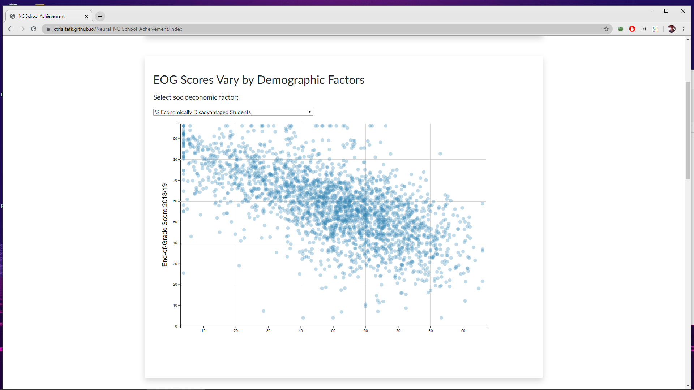
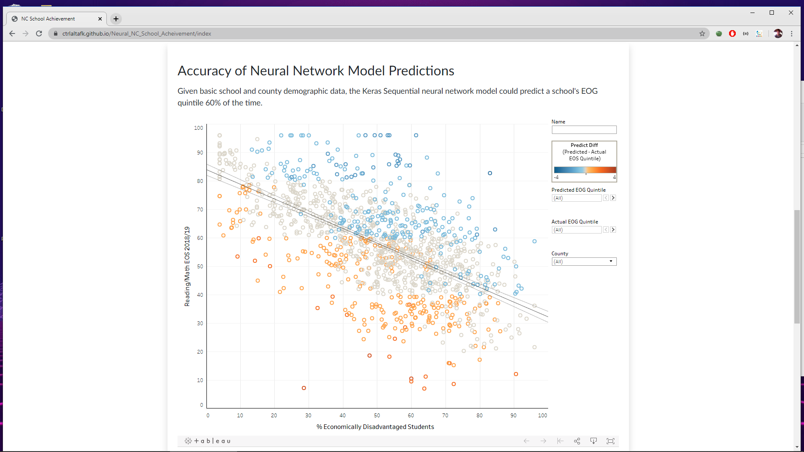
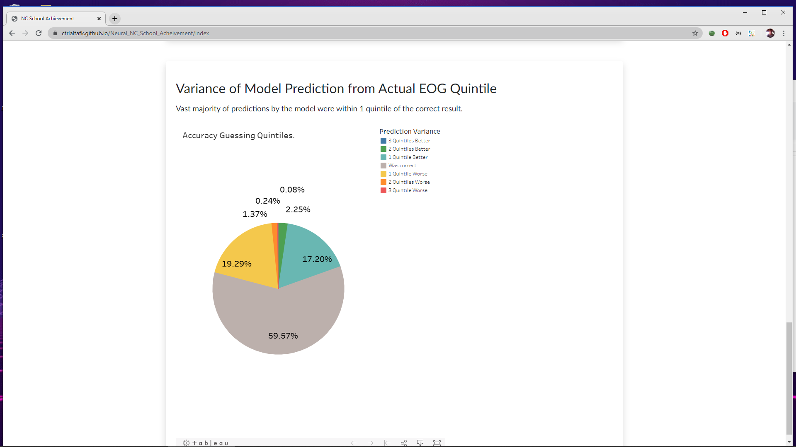

North Carolina School Achievement Forecaster.
https://ctrlaltafk.github.io/Neural_NC_School_Acheivement/index

For this project, we took data from https://www.nc.gov/agency/public-instruction-department
This has all sorts of demographic data about student population in public and charter schools, from race, income, to what percent of households have lead paint.

We then cleaned up the data and ran it through many different machine learning algorithms. We found that random forest and neural networks got us similar results. We could guess the exact letter grade a school would get on their final tests 60% of the time and we were only off by plus or minus one letter grade 96% of the time. We believe that if we used data from every school in the country the algorithm would be even more accurate. This could be a good tool for prospective parents to use before sending their student to a particular school or for superintendents to see which schools are underperforming.

This animated graph was programmed from scratch using D3. You can hover over each bubble to see a school and some select facts about. It shows some of the most likely predictors of which schools are more or less likely to succeed.

These graphs were created with tableau. They shows how accurate our machine learning algorithms were.
